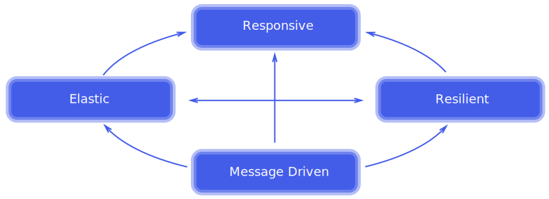

响应式编程实践
============

## 1. 什么是响应式编程(Reactive Programming)

- 响应式编程 是一种 基于对变化的响应的一种编程范式
- RxJava响应式编程 = 观察者模式(Observer Pattern) + 迭代器模式(Iterator Pattern) + 函数式编程

## 2. 响应式编程规范以相关实现

### 2.1 响应式宣言（[reactive manifesto](https://github.com/reactivemanifesto/reactivemanifesto)）： 
响应式宣言针对一个系统而言，并不等同于 响应式编程规范，响应式系统应该满足如下特点：
- 
- 

### 2.2 [Reactive Streams](http://www.reactive-streams.org/) 规范

- Reactive Streams 规范提供一个非堵塞的异步流处理的抗压(breakpressure)标准；
- 对于JVM，目前已经有多个库实现该标准，RxJava2, akka-streams,reactor；
- Reactive Streams 接口有：

- Reactive Streams 规范主要目标[[2]](https://www.infoq.com/news/2015/09/reactive-streams-introduction)：
    
    - 通过异步边界(Asynchronous Boundary)[[3]](https://github.com/reactive-streams/reactive-streams-jvm/issues/46)来解耦系统组件。 解偶的先决条件，分离事件/数据流的发送方和接收方的资源使用;
    - 为背压（back pressure）处理定义一种模型。流处理的理想范式是将数据从发布者推送到订阅者，这样发布者就可以快速发布数据，同时通过压力处理来确保速度更快的发布者不会对速度较慢的订阅者造成过载。压力处理通过使用流控制来确保操作的稳定性并能实现优雅降级，从而提供弹性能力。

### 2.3 Reactive Extensions  (ReactiveX,Rx)
- ReactiveX是Reactive Extensions的缩写，一般简写为Rx，最初是LINQ的一个扩展，由微软的架构师Erik Meijer领导的团队开发，在2012年11月开源[[1]](http://download.microsoft.com/download/4/E/4/4E4999BA-BC07-4D85-8BB1-4516EC083A42/Rx%20Design%20Guidelines.pdf)；

- Rx是一个编程模型，目标是提供一致的编程接口，帮助开发者更方便的处理异步数据流，Rx库支持.NET、JavaScript和C++，Rx近几年越来越流行了，现在已经支持几乎全部的流行编程语言了，Rx的大部分语言库由ReactiveX这个组织负责维护，比较流行的有RxJava/RxJS/Rx.NET，社区网站是 reactivex.io。

- Rx = Observables + LINQ + Schedulers。Rx 让开发者可以利用可观察序列和LINQ风格查询操作符来编写异步和基于事件的程序  

### 2.4 RxJava 简介

- RxJava 是 在Java虚拟机上实现的Reactive Extensions（响应式扩展)库;

- RxJava 2.0 已经按照Reactive-Streams specification规范完全的重写;
- 2.0 已经独立于RxJava 1.x而存在。

## 为什么需要响应式编程

|| 单个数据 	|  多个数据 | 
|:--|:--|:--|
| 同步	|T getData()        |	Iterable<T> getData()   |
| 异步	|Future<T> getData()|	Observable<T> getData() |

https://www.lightbend.com/blog/7-ways-washing-dishes-and-message-driven-reactive-systems

## RxJava 实践

### 异步 ()

### 流式处理（Fluent Style） 

## 再谈函数式编程

### Functor 和 Monads

http://ifeve.com/java%E4%B8%AD%E7%9A%84functor%E4%B8%8Emonad/

## Reference

1. 响应式宣言.https://github.com/reactivemanifesto/reactivemanifesto/blob/master/README.zh-cn.md

